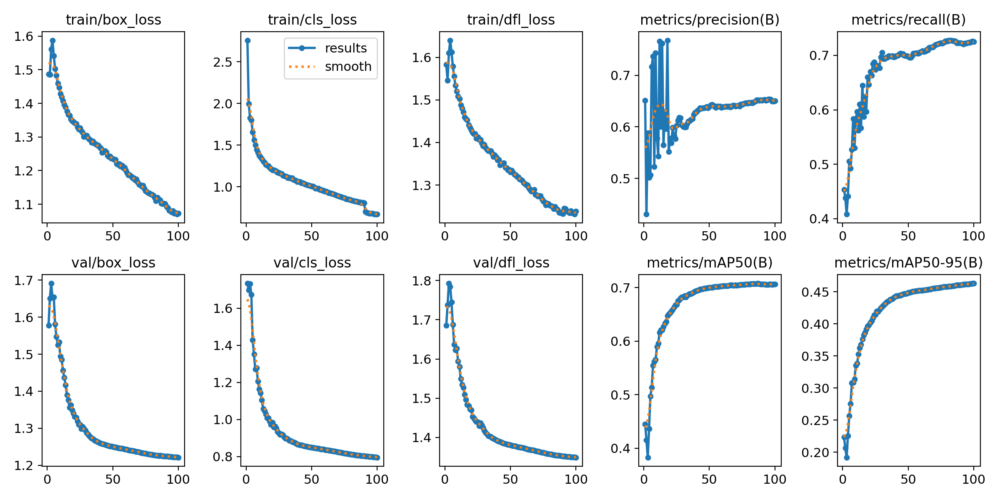

# YOLO-PPE-Detection
YOLOv11n - based PPE detection model trained for iOS real-time inference via CoreML

A YOLOv11n-based Personal Protective Equipment (PPE) detection model trained for real-time inference on iOS via CoreML.

This repository is part of a workplace safety inspection app that combines PPE detection with pose estimation (MoveNet) in a single camera pipeline.

---

## Detection Classes

| ID | Class | Description |
|---|---|---|
| 0 | `Hardhat` | Safety helmet worn |
| 1 | `NO-Hardhat` | Safety helmet not worn |
| 2 | `NO-Safety Vest` | Safety vest not worn |
| 3 | `Person` | Person |
| 4 | `Safety Vest` | Safety vest worn |

---

## Results

| Metric | Value |
|---|---|
| Precision | 0.650 |
| Recall | 0.726 |
| **mAP50** | **0.706** |
| mAP50-95 | 0.463 |

Training curves, confusion matrix, and per-epoch metrics are available in [`results/`](results/).



---

## Repository Structure

```
yolo-ppe-detection/
├── data.yaml              # Class definitions (set your own dataset path)
├── train.py               # Training script with full hyperparameter config
├── export_coreml.py       # CoreML export script with NMS support
├── results/
│   ├── results.png        # Loss & mAP curves
│   ├── confusion_matrix.png
│   ├── confusion_matrix_normalized.png
│   ├── BoxF1_curve.png
│   ├── BoxPR_curve.png
│   ├── results.csv        # Per-epoch metrics
│   └── args.yaml          # Full training arguments
├── weights/
│   └── README.md          # Download links for best.pt and .mlpackage
└── .gitignore
```

---

## Dataset

- Source: Roboflow PPE public datasets
- **Training images and label files are not included** in this repository due to dataset license restrictions.
- Refer to `data.yaml` for the class structure and configure the dataset path for your local environment.

---

## Setup

```bash
pip install ultralytics coremltools onnx
```

---

## Training

```bash
python train.py
```

Key training configuration:

| Parameter | Value | Notes |
|---|---|---|
| Model | `yolo11n.pt` | YOLOv11 nano |
| Epochs | 100 | |
| Batch | 10 | |
| imgsz | 832 | Larger input for small PPE objects |
| Optimizer | auto | |
| cos_lr | True | Cosine annealing LR schedule |
| close_mosaic | 10 | Mosaic disabled for last 10 epochs |
| patience | 100 | |

---

## CoreML Export

```bash
python export_coreml.py --weights runs/ppe_yolo11n_832/weights/best.pt --imgsz 640 --nms
```

The export process requires multiple steps. See [`export_coreml.py`](export_coreml.py) for details on options and known issues.

| Option | Value | Notes |
|---|---|---|
| imgsz | 640 | Reduced from 832 for mobile inference speed |
| nms | True | NMS included inside the model |
| half | False | FP32 (FP16 optional, verify on device) |

---

## iOS Integration

The exported `.mlpackage` is used in an iOS app with the following pipeline:

```
AVFoundation (camera frames)
    ↓
Vision (CoreML request handling)
    ↓
CoreML (PPE object detection)
    ↓
UIKit (bbox & label overlay)
```

Key considerations when integrating with Xcode:
- Vision returns bounding boxes with **bottom-left origin** — Y-axis flip required for UIKit
- Explicit `orientation` must be passed to `VNImageRequestHandler` to avoid rotated detections in portrait mode
- iOS 16 and iOS 17+ handle `videoOrientation` differently

---

## Weights

Pre-trained weights are available on the [Releases](../../releases) page.

| File | Description |
|---|---|
| `best.pt` | YOLOv11n trained weights (PyTorch) |
| `DetectionYolov11.mlpackage` | CoreML model for iOS |

---

## Training Environment

| Item | Details |
|---|---|
| Platform | Google Colab Pro |
| GPU | A100 |
| Framework | Ultralytics 8.3.179 |
| Python | 3.13 |

---

